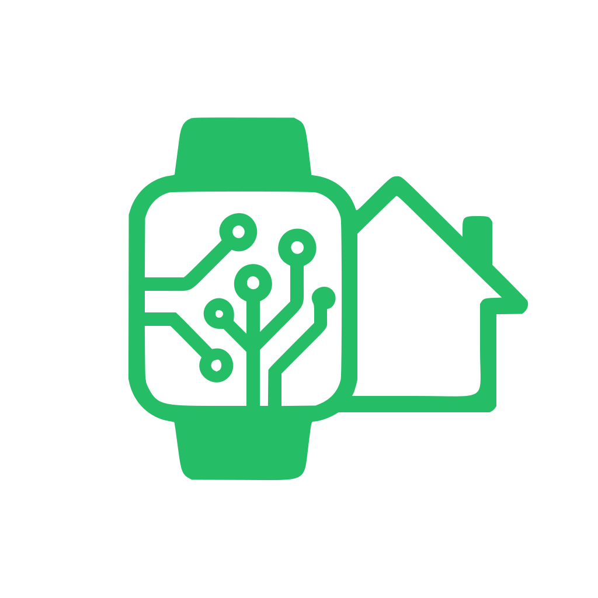

# 🏃 Zepp2Hass - Zepp Smartwatch Integration for Home Assistant

<div align="center">




**Connect your Zepp smartwatch to Home Assistant and track your health & fitness data in real-time! 📊**

[](https://github.com/davidepalleschi/zepp2hass/releases)
[](https://github.com/davidepalleschi/zepp2hass/issues)
[](https://github.com/davidepalleschi/zepp2hass/blob/main/LICENSE)

</div>

---

## ✨ Features

### 📡 Real-time Data via Webhook

Zepp2Hass receives data from your Zepp smartwatch via a local webhook endpoint. When you configure the integration, it creates a unique webhook URL that accepts JSON payloads with all your health metrics.

**Rate limiting** is built-in to protect your Home Assistant instance: max 30 requests per 60 seconds per device.

### 🌐 Web Interface

Each webhook includes a minimalist web interface accessible via your browser, specifically designed for quick URL retrieval.

**How to find your URL:**

1. Navigate to **Settings** → **Integrations** → **Zepp2Hass**.
2. Select your **Device Name**.
3. Under **Device Info**, click **Visit** to open the interface.
4. Use the **one-click copy button** to grab your webhook URL.

### 📊 Comprehensive Sensor Suite

The integration creates multiple sensor types organized by category:

| Category | Sensors |
|----------|---------|
| **Health** | Heart Rate (last, resting, max), Body Temperature, Stress, Blood Oxygen |
| **Activity** | Steps, Calories, Fat Burning, Stands, Distance (all with goal targets) |
| **Sleep** | Sleep Score, Total Duration, Deep Sleep, Sleep Start/End Time |
| **Workout** | Training Load, Last Workout, Workout History, VO2 Max |
| **Device** | Battery, Screen Status/AOD/Brightness, Device Info, User Info |
| **PAI** | Weekly PAI score with daily PAI as attribute |
| **Binary Sensors** | Is Wearing, Is Moving, Is Sleeping |

---

## 🚀 Installation

### HACS ⭐

1. Open **HACS** in Home Assistant
2. Search for **Zepp2Hass** in HACS
3. Click **Download**
4. Restart Home Assistant

---

## ⚙️ Configuration

### Step 1: Add the Integration

1. Go to **Settings** → **Devices & Services**
2. Click **Add Integration**
3. Search for **Zepp2Hass**
4. Enter a **device name** (e.g., "My Zepp Watch", "Amazfit Band 7")
5. Click **Submit**

### Step 2: Get Your Webhook URL

After adding the integration, you can get your webhook URL:

**Integration Interface** - Go to Settings → Integrations → Zepp2Hass → Click on device name → Under "Device Info" click "Visit". This will take you to the web interface.
   
The URL format is:
```
http://YOUR_HOME_ASSISTANT_BASE_URL/api/webhook/WEBHOOK_ID
```
> **Advanced:** You can change the **Base URL** at any time by going to **Settings** → **Devices & Services** → **Zepp2Hass** → **Configure**. The integration will automatically reload to apply the new URL.

### Step 3: Install and Configure the Zepp2Hass App on Your Watch

To send data from your Zepp smartwatch to Home Assistant, you need to install the **zepp2hass** app on your watch and configure it:

> **Prerequisites:** You need the **Zepp** app installed on your smartphone.

1. **Install the App from Zepp Store**
   - Open the **Zepp** app on your smartphone
   - Navigate to the **Zepp Store** (internal app store within the Zepp app)
   - Search for **"zepp2hass"** and install it on your smartwatch

2. **Configure the Webhook**
   - In the **Zepp** app, go to **Device Application Settings** → **More**
   - Find the **zepp2hass** app in the list
   - Enter the webhook URL you copied from Step 2
   - Optionally, adjust the **update interval** (default: 1 minute)
     - Increasing the interval (e.g., 2-5 minutes) will save battery life
     - Decreasing the interval provides more frequent updates but may drain battery faster

3. **Apply Settings on Your Watch**
   - Open the **zepp2hass** app directly on your smartwatch
   - Click the **"Apply settings"** button at the bottom

> **Tip:** For most use cases, a 2-5 minute interval provides a good balance between data freshness and battery life.

---

## 📱 Supported Devices

<details>
<summary>Click to see supported devices</summary>

### 🏃 Serie Balance
- Amazfit Balance
- Amazfit Balance 2
- Amazfit Balance 2 XT

### 🦕 Serie T-Rex (Rugged)
- Amazfit T-Rex Ultra
- Amazfit T-Rex 3
- Amazfit T-Rex 3 Pro (44mm)
- Amazfit T-Rex 3 Pro (48mm)

### 🐆 Serie Cheetah (Running)
- Amazfit Cheetah (Round)
- Amazfit Cheetah (Square)
- Amazfit Cheetah Pro
- Amazfit Cheetah Pro Kelvin Kiptum

### 💪 Serie Active
- Amazfit Active
- Amazfit Active Edge
- Amazfit Active 2 (Round)
- Amazfit Active 2 NFC (Round)
- Amazfit Active 2 (Square)
- Amazfit Active 2 NFC (Square)

### ⌚ Serie GTR & GTS
- Amazfit GTR 4
- Amazfit GTR 4 Limited Edition
- Amazfit GTS 4

### 📟 Serie Bip
- Amazfit Bip 5 Unity
- Amazfit Bip 5 Core
- Amazfit Bip 6

### 🎯 Other Models
- Amazfit Falcon

</details>

---

## 🎯 Usage Examples

**Battery low automation:**
```yaml
automation:
  - alias: "Zepp Battery Low"
    trigger:
      - platform: numeric_state
        entity_id: sensor.my_zepp_watch_battery
        below: 20
    action:
      - service: notify.mobile_app_your_phone
        data:
          message: "🔋 Watch battery low: {{ states('sensor.my_zepp_watch_battery') }}%"
```
---

## 🔧 Troubleshooting

### Sensors not updating?

1. **Check the webhook URL** - Visit it in your browser to verify it's accessible
2. **Check Home Assistant logs** - Look for errors under Settings → System → Logs
3. **Verify network** - Ensure the device sending data can reach Home Assistant

### Test the webhook with curl

```bash
curl -X POST http://YOUR_HA_IP:8123/api/webhook/YOUR_WEBHOOK_ID \
  -H "Content-Type: application/json" \
  -d '{
    "battery": {"current": 80},
    "steps": {"current": 5000, "target": 10000},
    "heart_rate": {"last": 72, "resting": 58},
    "is_wearing": 1
  }'
```

> **Note:** Replace `YOUR_WEBHOOK_ID` with the actual webhook ID from your integration. You can find it by visiting the webhook URL in your browser (GET request) or checking Home Assistant logs.

Expected response:
```json
{"status": "ok"}
```
---

## 🤝 Contributing

Contributions are welcome! 🎉

1. Fork the repository
2. Create a feature branch (`git checkout -b feature/amazing-feature`)
3. Commit your changes (`git commit -m 'Add amazing feature'`)
4. Push to the branch (`git push origin feature/amazing-feature`)
5. Open a Pull Request

---

## 📄 License

This project is licensed under the MIT License - see the [LICENSE](LICENSE) file for details.

---

## 🙏 Acknowledgments

- Zepp/Amazfit for creating amazing smartwatch devices
- Home Assistant community for inspiration and support
- HACS for making custom integrations easy to install

---

## 📞 Support

- 🐛 **Found a bug?** [Open an issue](https://github.com/davidepalleschi/zepp2hass/issues)
- 💡 **Have a feature request?** [Create a feature request](https://github.com/davidepalleschi/zepp2hass/issues/new)
- 📧 **Questions?** Check the [Issues](https://github.com/davidepalleschi/zepp2hass/issues) page

---

<div align="center">

**Made with ❤️ for the Home Assistant community**

⭐ **Star this repo if you find it useful!** ⭐

</div>
